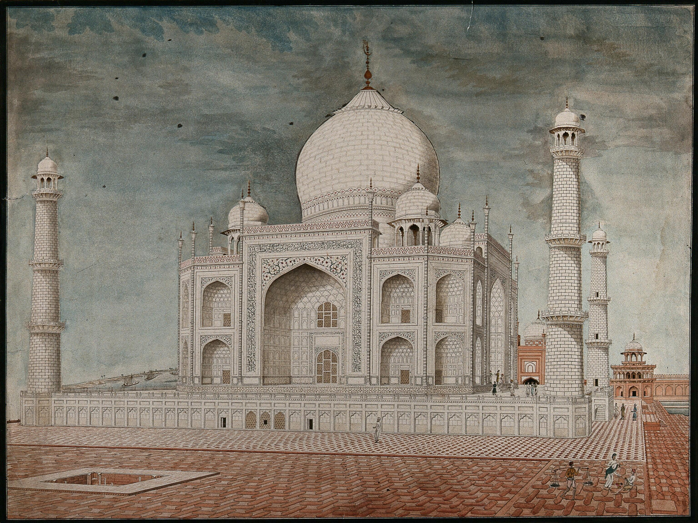

# Watercolour

## Tips on how to recognise

* Look at the surface of the painting. Brush strokes are less clear in watercolours and the painting should have very little to no visible texture.   
* The colour of the paper underneath may affect the colour or be clear due to its translucent properties. This can give the illusion of luminosity to the painting too.  
* Look at the design of the painting. Often watercolour are used in conjunction with other techniques, particularly prints that are then coloured using watercolour. 

### Dating 



Watercolour painting is one of the oldest forms of painting being found in palaeolithic Europe cave paintings. It has been commonly use in East Asian work including Chinese, Korean and Japanese traditions and post-renaissance Europe until present.     

### Support

Watercolours are usually painted on to paper or canvas but other known supports include papyrus, bark, plastic, vellum, leather, fabric and wood.

